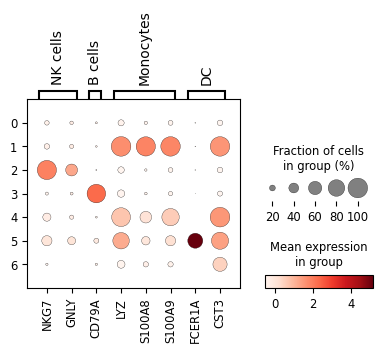

## scRNA-seq Analysis
Downloaded a public scRNA-seq dataset → QC → normalization → clustering → marker genes → cell-type annotation.


Dataset: 10x Genomics 3k PBMCs from a Healthy Donor\


Link: https://www.10xgenomics.com/datasets/3-k-pbm-cs-from-a-healthy-donor-1-standard-1-1-0?utm_source=chatgpt.com\


---
## Repository Structure

```text

scRNAseq_PBMC3k_from_scratch/
├─ README.md
├─ LICENSE
├─ .gitignore
├─ data/
│  ├─ raw/              # downloaded 10x matrix files 
│  └─ processed/        # saved Seurat/AnnData objects
├─ notebooks/
│  ├─ scRNA_seq.ipynb
│  └─ 01_seurat_qc_clustering.Rmd
├─ scripts/
│  ├─ python/
│  │  ├─ scRNA_seq.ipynb
├─ results/
│  ├─ figures/
│  └─ tables/
├─ env/
└──environment.yml   # conda for python

```
---



